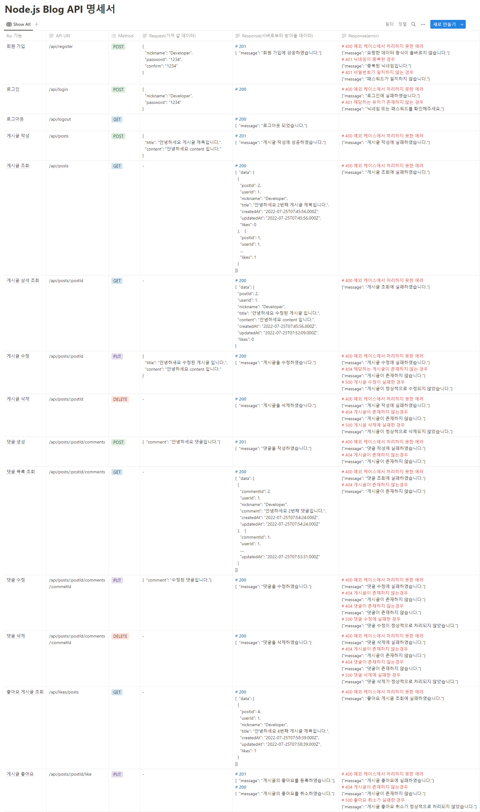

# 블로그 API 서버

회원, 게시글, 댓글, 좋아요 기능이 추가된 블로그 백엔드 서버   

> 접속 URI: [http://3.34.196.250](http://3.34.196.250)

## 목차

- [Install](#install)
- [Usage](#usage)   
  - [.env settings](#env-settings)   
- [DB Schema](#db-schema)
- [DB Diagram](#db-diagram)
- [API](#api)
- [구현 중 겪은 어려운 부분](#구현-중-겪은-어려운-부분)

## Install

```
cd app
npm install
```

## Usage

```
vim .env (env 파일 세팅)
node bin/www.js
```

### env Settings
```
NODE_ENV="development"
# NODE_ENV="test"
# NODE_ENV="production"

PORT=

MYSQL_USERNAME=""
MYSQL_PASSWORD=""
MYSQL_DATABASE=""
MYSQL_HOST=""

BCRYPT_SALT=

JWT_SECRET_KEY=""
JWT_ACCESS_EXPIRES=""
JWT_REFRESH_EXPIRES=""
```

## DB Schema

</img>

## DB Diagram

</img>

## API

</img>

## 문제해결 사례

- [복잡한 쿼리문을 Sequelize로 구현하기:](https://4sii.tistory.com/246)   
Sequelize.query를 통해 raw query를 그대로 사용하는 방법으로 해결했다.
- [작성중..]
